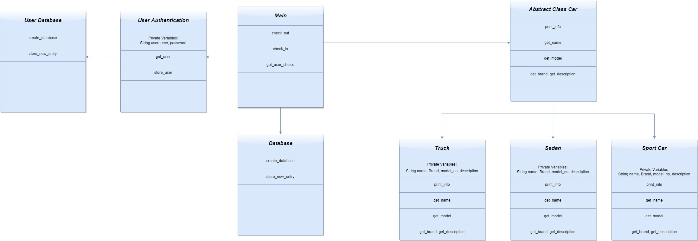

# Project Documents
All design documents that were used for the creating of this project will be stored in this section. I have included the overall architeture below.

## Classes

### Car

All of the more specific car classes inherit from this abstract class.
### Sedan

Is basically just the abstract Car class whith specific values for name, model, etc.
### Sports Car

Is basically just the abstract Car class whith specific values for name, model, etc.
### Truck

Is basically just the abstract Car class whith specific values for name, model, etc.
### User Authentication

Checks for correct username and password by checking the User Database and has functions that return those values or add them to the database.

## User Flow
